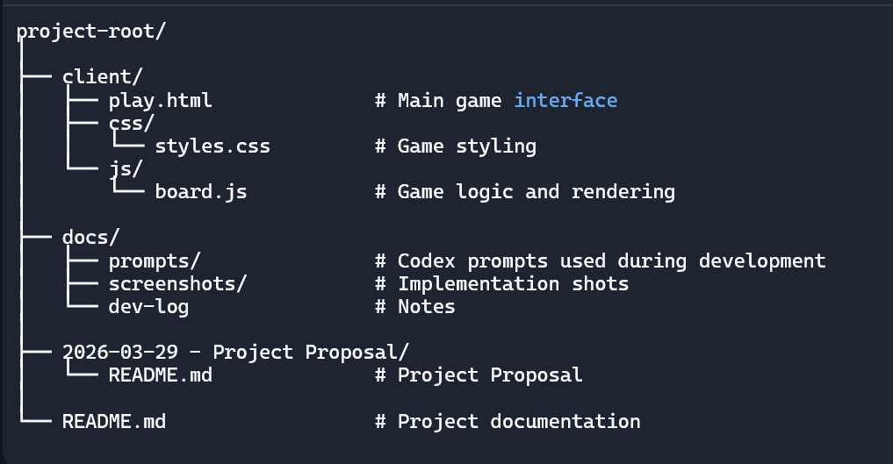

# AI-BASED CONNECT FOUR GAME WITH PERSISTENT GAMEPLAY

# Project Group Members:

* Dominic Asiedu (202296254, dasiedu@mun.ca) 
* Sifat Sabrina Rahman (202286725,ssrahman@mun.ca)

# Project URL

* Paste your hosted web application URL here so I can test it
  
# Project Videos:

* Project Presentation: YouTube URL

# Project Setup / Installation:

## System Requirements

Before running the project, ensure the following software is installed:

- A modern web browser  
  *(Recommended: Google Chrome, Microsoft Edge, or Firefox)*

- **Visual Studio Code (VS Code)**  
  Used to open and manage the project files.

- **Live Server Extension (VS Code)**  
  Used to run the web application locally for now.

No additional frameworks or package installations are required since the project is implemented using **vanilla JavaScript, HTML, and CSS**.

---
# Project Structure (Will be Updated incrementally)

---

