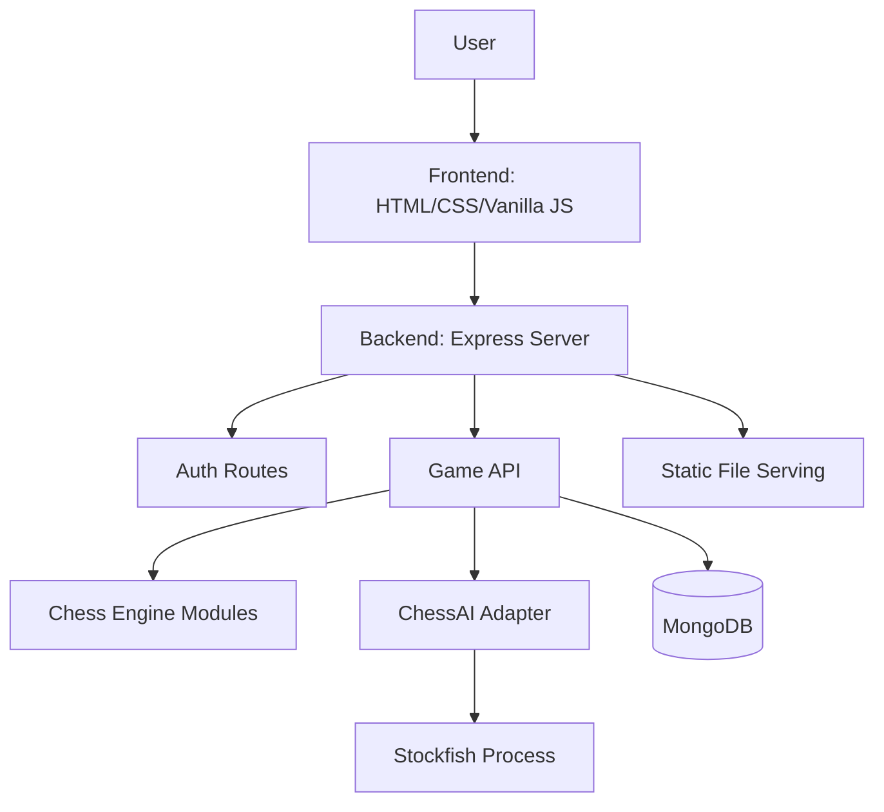
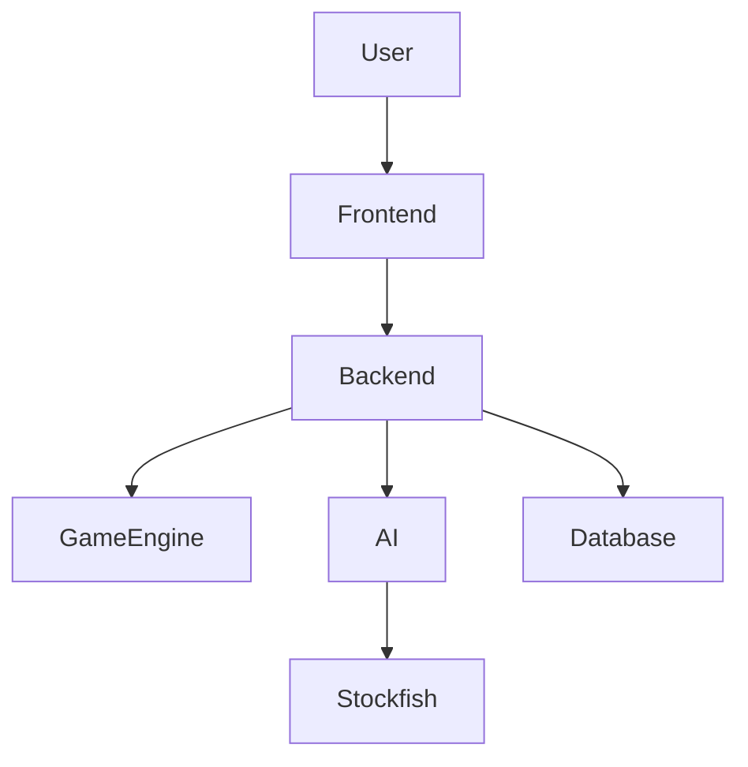
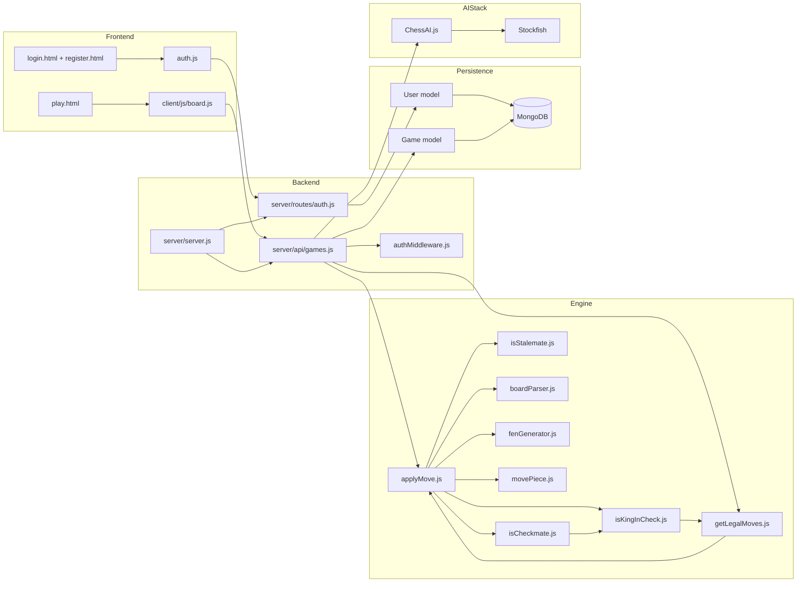
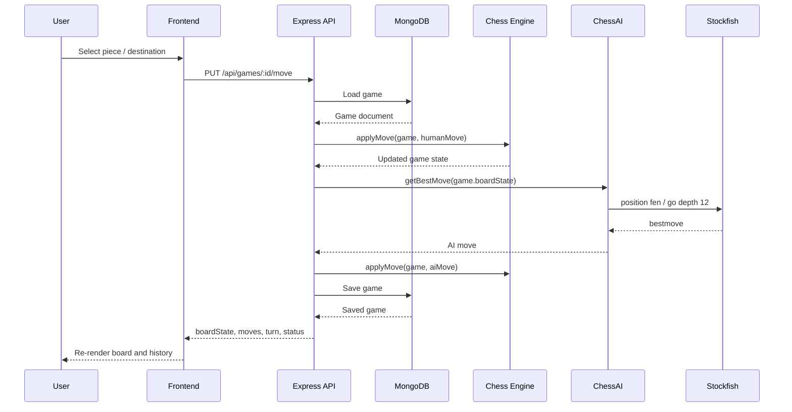

# System Architecture

## System Overview

This project is a full-stack chess application that combines a browser-based interface, an Express backend, MongoDB persistence, custom chess rule enforcement, and Stockfish-powered AI move generation. The server is the central orchestrator: it serves the frontend, exposes gameplay and authentication APIs, validates and applies moves through the chess engine, persists game state in MongoDB, and invokes Stockfish when the AI needs to respond.

The system supports:

- User registration and login
- Persistent game sessions per authenticated user
- Resume of an active saved game
- Legal move generation and move validation
- Check, checkmate, stalemate, castling, promotion, and en passant handling
- AI opponent moves using Stockfish
- Move history, undo, captures, and material tracking in the UI
- Docker-based deployment with MongoDB and server containers

At runtime, the architecture is centered around one Node.js process:

- The browser renders HTML/CSS/Vanilla JS pages from `client/`
- The frontend calls REST endpoints under `/api/auth` and `/api/games`
- Express routes delegate to MongoDB models and chess service modules in `server/chess/`
- The AI adapter in `server/ai/ChessAI.js` launches a Stockfish process and returns the best move
- The database stores users plus serialized game state, including FEN board snapshots and move history

## Repository Structure

```text
client/
  login.html, register.html, play.html
  auth.js
  css/
  js/
server/
  server.js
  db.js
  api/
  routes/
  middleware/
  models/
  controllers/
  ai/
  chess/
  tests/
docker/
  Dockerfile
  docker-compose.yml
docs/
```

## High-Level Architecture



## Layered Architecture

### Frontend Layer

The frontend is a server-served, multi-page browser UI built with plain HTML, CSS, and JavaScript.

Primary pages:

- `client/login.html`: login form
- `client/register.html`: registration form
- `client/play.html`: active gameplay screen
- `client/index.html`: placeholder page, not the main entry point
- `client/history.html` and `client/replay.html`: present but currently empty

Primary active scripts:

- `client/auth.js`: handles registration and login requests, stores JWT token and user name in `localStorage`
- `client/js/api.js`: shared helper that adds `Authorization` header and redirects on `401`
- `client/js/board.js`: main gameplay controller and view renderer

`client/js/board.js` currently performs most gameplay UI responsibilities:

- Builds the chessboard DOM
- Converts board coordinates to square labels
- Tracks selected piece and current turn
- Requests legal moves from the backend
- Sends player moves to the backend
- Renders FEN board state into the board
- Updates move history, captured pieces, and material score
- Handles restart, undo, logout, AI thinking state, and checkmate modal

Frontend interaction flow:

1. User logs in or registers from `login.html` or `register.html`
2. `auth.js` stores the JWT token and redirects to `/play`
3. `play.html` loads `client/js/api.js` and `client/js/board.js`
4. `board.js` calls `POST /api/games` to create or resume the user’s active game
5. The server returns the current persisted game state
6. User clicks a piece, then `GET /api/games/:id/legal-moves`
7. User clicks a destination square, then `PUT /api/games/:id/move`
8. Backend returns the updated board after the human move and, when applicable, the AI move
9. UI re-renders from returned FEN and move metadata

### Backend Layer

The backend is a single Express application defined in `server/server.js`.

Core responsibilities:

- Connect to MongoDB through `server/db.js`
- Register middleware (`cors`, `express.json`)
- Mount authentication and game APIs
- Serve static frontend assets from `client/`
- Route browser requests for `/`, `/register`, and `/play`

Mounted route groups:

- `/api/auth` -> `server/routes/auth.js`
- `/api/games` -> `server/api/games.js`

Supporting backend modules:

- `server/middleware/authMiddleware.js`: JWT verification and `req.userId` injection
- `server/controllers/undoMove.js`: game undo controller
- `server/models/User.js`: MongoDB user schema
- `server/models/Game.js`: MongoDB game schema

Important implementation note:

- There are two auth route modules: `server/routes/auth.js` and `server/api/auth.js`
- The live server mounts `server/routes/auth.js`
- The frontend payload shape matches `server/routes/auth.js` (`name`, `email`, `password`), not `server/api/auth.js`
- `server/api/auth.js` appears to be an alternate or newer version, but it is not used by `server/server.js`

### Game Engine Layer

The chess engine lives in `server/chess/` and is responsible for board parsing, move validation, state transitions, and endgame detection.

Key modules requested in this phase:

- `boardParser.js`
- `fenGenerator.js`
- `getLegalMoves.js`
- `applyMove.js`
- `isKingInCheck.js`
- `isCheckmate.js`

Supporting modules:

- `movePiece.js`
- `isStalemate.js`
- `notation.js`
- `initialBoard.js`
- `legalMoves/` generators for each piece
- `validate*` modules for movement rule validation

#### Engine Responsibilities By Module

`boardParser.js`

- Converts persisted FEN board strings into an 8x8 matrix
- Used whenever the server needs structured board access

`fenGenerator.js`

- Converts an 8x8 board matrix back into compact FEN board notation
- Used after simulated or committed board changes

`getLegalMoves.js`

- Dispatches to piece-specific move generators
- Supports en passant target injection through `options.enPassantTarget`
- Supports `skipKingSafety` when used for attack detection
- Intended to filter out moves that leave the king in check, though the current implementation returns early before that safety-filter block runs

`isKingInCheck.js`

- Finds the king for a given color
- Iterates over opposing pieces
- Reuses `getLegalMoves(..., { skipKingSafety: true })` to determine attack squares

`isCheckmate.js`

- First verifies the side is in check
- Enumerates all moves for that side
- Simulates each move on a cloned board
- Converts the simulated board to FEN and asks `isKingInCheck` whether check is escaped
- Returns `true` only when no escape exists

`applyMove.js`

- Main state transition function for gameplay
- Accepts either a game object or a raw board array
- Validates game status and turn ownership
- Tracks castling rights
- Validates castling path safety
- Calls `movePiece.js` for piece movement validation
- Handles en passant capture cleanup
- Handles pawn promotion to queen
- Updates FEN, turn, history, check state, notation, move log, winner, and status
- Invokes `isCheckmate` and `isStalemate` after move application

#### Engine Interaction Sequence

1. Backend loads `game.boardState` from MongoDB
2. `boardParser.js` converts FEN into a 2D board
3. `getLegalMoves.js` is used for legal move highlighting
4. `applyMove.js` performs the authoritative move update
5. `movePiece.js` validates piece movement rules
6. `fenGenerator.js` serializes the updated board
7. `isKingInCheck.js`, `isCheckmate.js`, and `isStalemate.js` evaluate post-move state
8. Updated FEN and metadata are saved back to MongoDB

### AI Layer

The AI layer is implemented in `server/ai/ChessAI.js` and is invoked by `PUT /api/games/:id/move` after a successful human move if the game remains active and the turn becomes black.

AI flow:

1. The human move is applied through `applyMove(game, ...)`
2. The backend reads the new `game.boardState`
3. That FEN string is passed to `getBestMove(fen)` in `ChessAI.js`
4. `ChessAI.js` starts a Stockfish child process using:
   - Windows path: `C:\stockfish\stockfish-windows-x86-64-avx2.exe`
   - Linux/Docker path: `/usr/games/stockfish`
5. The adapter sends UCI commands:
   - `uci`
   - `isready`
   - `position fen <fen>`
   - `go depth 12`
6. Stockfish emits a `bestmove` line
7. The adapter parses coordinate notation such as `e7e5`
8. The route converts algebraic squares to board row/column indices
9. The backend applies the AI move through the same `applyMove(game, ...)` path
10. The final combined game state is saved and returned to the frontend

Important design characteristic:

- The AI is not a separate service; it is a subprocess launched by the backend on demand
- This keeps the deployment simple but couples request latency to engine execution time

Important implementation note:

- The project mostly stores board-only FEN strings such as `rnbqkbnr/pppppppp/...`
- `server/tests/testAI.js` uses full FEN with active color/castling fields
- `ChessAI.js` forwards whatever string it receives directly to Stockfish
- This means Stockfish integration depends on the format of `game.boardState` being acceptable for the engine path in use

### Database Layer

MongoDB is used for persistence through Mongoose.

Connection:

- `server/db.js` loads `server/.env`
- Uses `process.env.MONGO_URI` or defaults to `mongodb://localhost:27017/chessdb`

Models:

`server/models/User.js`

- Stores `name`, `email`, `password`
- Includes timestamps
- Used by the active auth routes in `server/routes/auth.js`

`server/models/Game.js`

- Stores `user` reference
- Stores serialized `boardState`
- Stores `moves` array with coordinates, piece, capture, notation, timestamp
- Stores `history` array of FEN snapshots
- Stores `turn`, `status`, `winner`
- Stores `enPassantTarget`
- Stores `castlingRights`
- Stores `createdAt`

Resume functionality:

- `POST /api/games` is both create and resume
- The route checks for an existing active game for `req.userId`
- If one exists, it returns that game instead of creating a new one
- If not, it initializes a fresh game with starting FEN, empty moves, and active status

Undo functionality:

- `PUT /api/games/:gameId/undo` uses `history`
- The controller pops the latest FEN snapshot, reassigns `boardState`, pops the last move, flips turn, and saves

Persistence strategy:

- The database stores the canonical game state
- The frontend is a projection layer rebuilt from the latest persisted FEN plus move metadata
- `history` acts as a lightweight replay/rollback source

### Docker Layer

The Docker deployment assets are in `docker/`.

`docker/docker-compose.yml`

- Starts `mongo` from `mongo:7`
- Starts `server` from `docker/Dockerfile`
- Maps Mongo to `27017`
- Maps the web server to `3000`
- Injects `MONGO_URI=mongodb://mongo:27017/chessdb`
- Persists Mongo data through the named volume `mongo_data`

`docker/Dockerfile`

- Uses `node:20`
- Installs Stockfish through `apt-get`
- Sets `/app` as working directory
- Copies server dependency manifests and runs `npm install`
- Copies `server/` and `client/`
- Exposes port `3000`
- Starts the app with `node server/server.js`

Container runtime behavior:

1. Build installs Node dependencies and the Stockfish binary
2. Compose launches MongoDB
3. Compose launches the Node/Express container
4. Express connects to Mongo through the compose service hostname `mongo`
5. Backend spawns `/usr/games/stockfish` for AI turns inside the container

Important implementation note:

- The Dockerfile copies `server/package*.json`, so dependency installation is driven by `server/package.json`, not the root `package.json`

## API Surface

### Authentication

Mounted from `server/routes/auth.js` under `/api/auth`.

- `POST /api/auth/register`
  - Creates a user with `name`, `email`, `password`
- `POST /api/auth/login`
  - Verifies credentials and returns `{ token, user }`

### Game APIs

Mounted from `server/api/games.js` under `/api/games`.

- `POST /api/games`
  - Auth required
  - Creates a new game or resumes an existing active game for the logged-in user
- `GET /api/games`
  - Returns all games, ordered by `createdAt desc`
- `GET /api/games/:id`
  - Returns a single game document
- `GET /api/games/:id/legal-moves?row=<n>&col=<n>`
  - Returns move targets for the selected square
- `PUT /api/games/:id/move`
  - Applies human move, optionally applies AI move, persists results
- `PUT /api/games/:gameId/undo`
  - Reverts one move using the `history` stack
- `PUT /api/games/:id`
  - Explicitly blocked with `403`; directs callers to `/move`

## Component Relationships

### System Component Diagram



### Layered Dependency Diagram



### Move Processing Sequence



## Data Flow

### Authentication Flow

1. Frontend submits credentials to `/api/auth/register` or `/api/auth/login`
2. Backend hashes password with `bcryptjs`
3. Backend creates or looks up the user in MongoDB
4. Login returns a JWT
5. Frontend stores token in `localStorage`
6. Protected game creation uses the token in the `Authorization` header

### Game Creation / Resume Flow

1. `board.js` requests `POST /api/games`
2. `authMiddleware.js` validates the JWT and sets `req.userId`
3. Backend searches for an active game owned by that user
4. If found, it returns the existing persisted game
5. Otherwise, it creates a new game document with starting FEN and initial metadata

### Legal Move Query Flow

1. Frontend sends board coordinates for the selected square
2. Backend loads the game by ID
3. Backend parses stored FEN into a 2D board
4. `getLegalMoves.js` returns piece move candidates
5. Frontend highlights those target squares

### Human + AI Move Flow

1. Frontend sends source and destination coordinates
2. Backend loads the current game
3. `applyMove.js` validates and commits the player move
4. Backend checks whether the turn changed to black and the game is still active
5. Backend asks Stockfish for the best move using current FEN
6. Returned algebraic coordinates are converted to board indices
7. `applyMove.js` commits the AI move
8. Final state is saved to MongoDB
9. Frontend re-renders using the returned `boardState`

## Current Architectural Strengths

- Clear separation between browser UI, API routing, persistence, chess rules, and AI adapter
- Reuse of the same `applyMove` logic for both player and AI turns
- FEN-based persistence keeps database storage compact
- `history` enables resume and undo without rebuilding from raw move logs
- Docker deployment bundles server runtime and Stockfish cleanly

## Current Architectural Gaps And Risks

These are important to understand when working with or extending the system.

- `client/js/board.js` is a very large all-in-one controller, so frontend concerns are centralized rather than modular
- Several frontend files (`play.js`, `history.js`, `replay.js`, `ui.js`) are currently unused or empty
- `server/api/auth.js` and `server/routes/auth.js` overlap, but only one is mounted
- `getLegalMoves.js` returns before its king-safety filtering logic runs, so move-highlighting may expose pseudo-legal rather than fully legal moves
- The server uses both board-only FEN strings and, in tests, full Stockfish-style FEN strings, which can create AI integration ambiguity
- Authentication is enforced for game creation, but read and move endpoints are not consistently protected
- Undo currently relies on `history` snapshots and turn flipping, but does not fully recompute derived state such as status, winner, or check flags after rollback

## Recommended Future Refactoring Directions

- Split `client/js/board.js` into rendering, API, state, and event modules
- Consolidate authentication into one route module and one shared JWT secret source
- Make all game-specific endpoints ownership-aware and consistently authenticated
- Fix legal move filtering so the move API returns only moves that preserve king safety
- Normalize the FEN contract used by persistence, engine utilities, and Stockfish integration
- Extract a service layer between Express routes and chess/domain modules for cleaner orchestration
- Add dedicated replay/history pages backed by existing `history` data

## Summary

The architecture is a monolithic but logically layered full-stack chess system. The browser UI is thin but stateful, the Express backend is the integration hub, MongoDB stores canonical game state, the custom chess engine enforces rules and produces state transitions, and Stockfish is invoked as a child process to generate AI moves. The project is already structured around sensible domain boundaries, and the main next step is refining those boundaries so the implementation matches the layered architecture more strictly.
